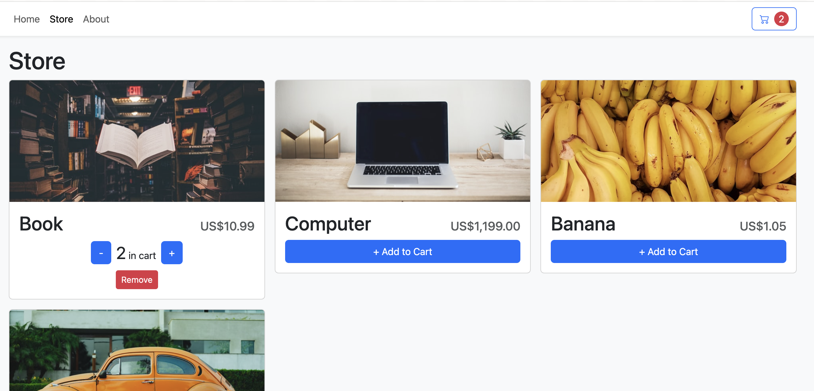

# shopping cart react and type script exercice

I made this project as a learning round for how real react application are done. 
 
I followed up a [tutorial from web dev simplifified](https://www.youtube.com/watch?v=lATafp15HWA&t=1788s&ab_channel=WebDevSimplified)

---

[see project]()

---

While doing this project I also reproduced the same shopping cart but using Hero UI
[see sister project](https://github.com/Jeremie-R/Shoppingcart-heroUI)